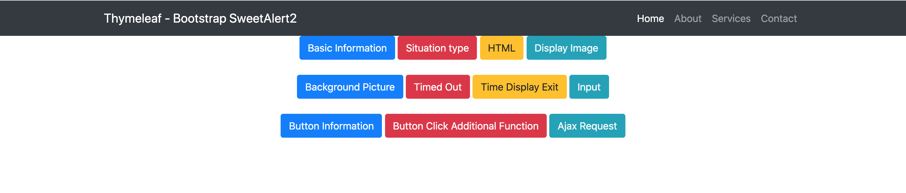
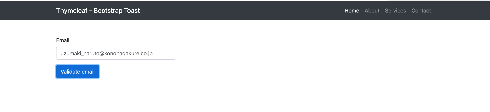
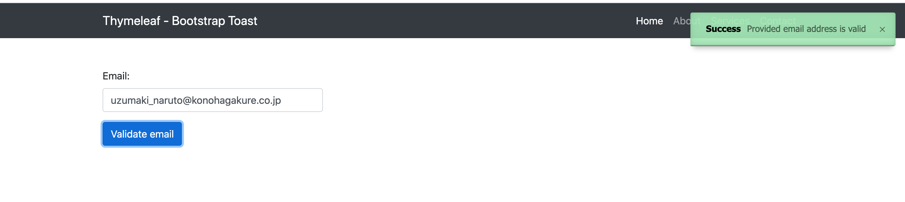

# springboot-sweetalert2
### Things todo list:
1. Clone this repository: `git clone https://github.com/hendisantika/springboot-sweetalert2.git`
2. Go inside the folder: `cd springboot-sweetalert2`
3. Run the application: `mvn clean spring-boot:run`
4. Open your favorite browser: http://localhost:8080

### Image Screen shot

SweetAlert2

Toast

 
 